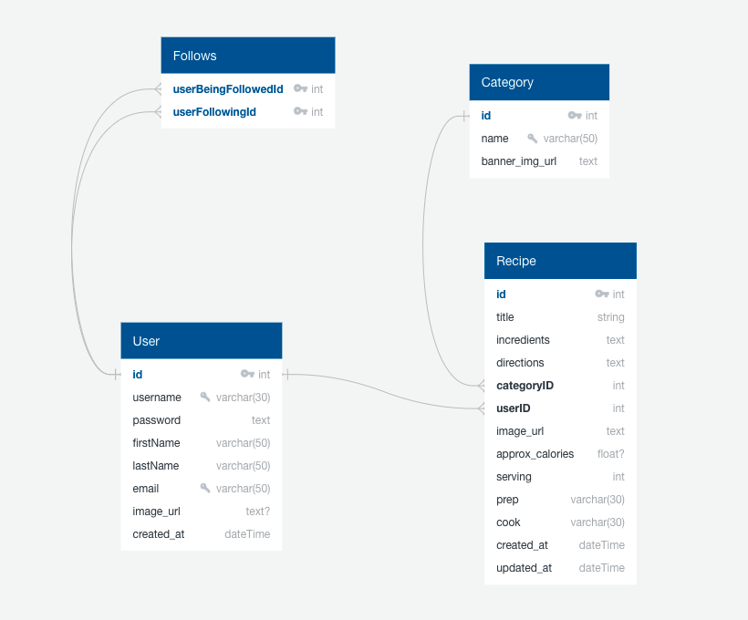

# Food Recipe Wep App

A web application that people can shared their own recipes with has an their own account and follow the other users for easy to access favorite cooker's recipes via following.

This web application provide many recipes that added by other users for help to cook and this recipe shows servings, cooking time, preperation time, and approximate calorie for per serving for every users.
Recipes are easily accessible under certain categories and can be searchable with specific queries on search box.

### Features

-   User can register the website for have a own account sharing for own recipes.
-   User can follow the other users and has to login the web app for following.
-   User can change later via profile their image url, firstname and lastname.
-   User can edit or delete own recipes.
-   Anonymous users can acces to all recipes for cooking and search the recipes.
-   User can add their recipes under certain category and enter serving, cooking time and preparetion time informations.
-   Approximate calories calculate automaticly using ingredient list when user add recipe.
-   Show approximate calories for per serving on recipe description.
-   Showing owner name and recipes count of owner under per recipes.
-   User can easily access own profile page from navbar.

### External APIs

Calorie will be calculated using **[external API](https://api-ninjas.com/api/nutrition)**.

### Database Schema

### Using Technologies in This Project

-   Python/Flask, Jinja
-   RESTful APIs
-   PostgreSQL, SQLAlchemy,
-   JavaScript, Axios, JQuery, HTML, CSS
-   Heroku
-   Some Libraries using with Flask:

    -   Flask-Login for authentication
    -   Flask-Migrate for create migrations
    -   Flask-Mail for reset password
    -   Flask-WTF for creating and validationg forms
    -   Flask-Bcrypt for create secure password using hashing

-   Flask Blueprint for organize the application with defines a collection of views, templates, static files.
-   Created different config setting for development, production and testing enviroments.

### Project Demo Link

You can check my food web application!

https://food-recipe-web-app.herokuapp.com/
