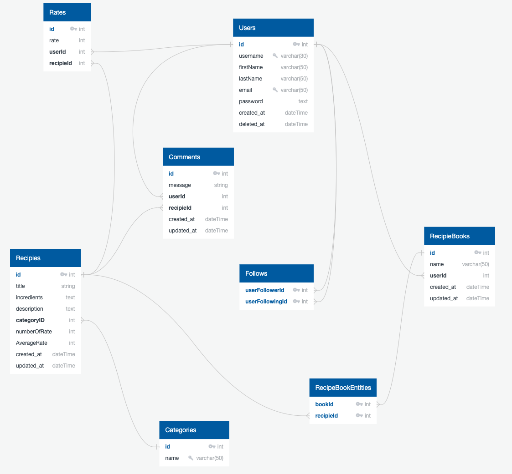

# Food Recipe Wep App

A web application that has many recipes that are shared by users. According to ingredient list, calculate the approximate calorie for specific recipe.

This web application provide many recipes access to other users for help to cook and this recipe can rate from other users and add to them comment. User can see total approximate calorie for the recipe and decided to pick recipe according to calorie.

### Features

-   User can share own recipe on web app only with login on page
-   Users can read recipes without login.
-   User can rate the recipies
-   User can make comment under the recipe
-   User can follow the other users
-   User create own cook recipe book and add the other recipies

### External APIs

Calorie will be calculated using **[external API](https://api-ninjas.com/api/nutrition)**.

### Database Schema

